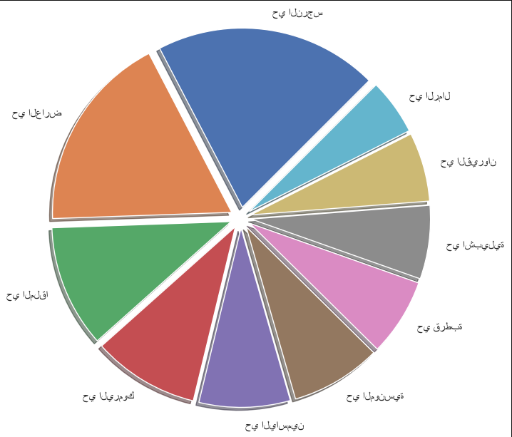

## Team Memebers 
- Sarraa Almudayfir 
- Samer Gharbi
- Naif Ghannam
- Mohammed Alamri

## Introduction
The project aims to analyze the prices of apartments, villas, and lands in Riyadh and identify their distribution across different neighborhoods.

## Objectives
- Dataset Overview
- Data Profiling
- Data Cleaning
- Data Visulaizition
- Conclusion

## Dataset Overview and Source
We analyzed three datasets related to rentals in the Riyadh area:
- Apartments in Riyadh:
- Lands in Riyadh
- Villas in Riyadh
For each dataset, we conducted Exploratory Data Analysis (EDA) and will present the results.

## Data Profiling
Data Quality Checks (7- key dimensions):

- Reliability:
We chose this dataset because it is available from a trusted platform, "Aqar." Aqar is a platform operated by Aqar Commercial Company, which is registered in the Kingdom of Saudi Arabia and manages and operates the platform's services. It is a reliable platform.

- Timeliness
The dataset for apartments in Riyadh is from 2022, which is relatively recent and suitable for our analysis, ensuring that the insights drawn are relevant.

- Consistency
We standardized the data types across the dataset to ensure consistency. Specifically:
i. Changed the data type of each column to the most suitable one 
ii. (converting numerical data stored as text to float).
iii. Converted binary data (0 and 1) to more meaningful labels (Yes and No).
iv. Transformed columns with object data types to float where appropriate, ensuring that all numerical values are properly formatted and ready for analysis.

- Relevance
We assessed each column in the dataset for its impact on the results. Any columns that were deemed irrelevant or not contributing to the analysis were dropped. 
This step helped streamline the dataset, focusing the analysis on the most impactful features and improving the overall efficiency and clarity of the results.

- Uniqueness
This dimension confirms the presence of duplicates. There are duplicate entries in the apartments dataset, but due to the lack of unique identifiers like an ID, duplicates were not removed.

- Completeness.
Checking for missing values 

- Check Accuracy.
i. check columns types
ii. check outliers

## Data Cleaning
- Handling missing values
- Correcting errors.
- Dealing with outliers.

## Visualiztion and Conclusion 

- Insight 1: A chart illustrating the top 10 neighborhoods in Riyadh with rental apartments.

- Insight 2: The number of furnished rental apartments in different neighborhoods in Riyadh.

- Insight 3: The chart here shows the relationship between furnished apartments and air conditioners. Specifically, it illustrates how many unfurnished apartments have air conditioning.

- Insight 4: The chart illustrates the age of the apartment compared to its price, revealing an inverse relationship where the price decreases as the age of the apartment increases.

- Insight 5: The chart shows the relationship between price and square meters. It indicates a direct relationship, where the price increases as the area of the apartment increases.

- Insight 6: The chart shows the top 100 most expensive plots of land along with the frequency of each plot.

- Insight 7: The chart illustrates the relationship between land prices in different areas of Riyadh.

- Insight 8: The chart shows the number of plots of land that have the same number of rooms. Each column represents a specific number of rooms and indicates how many plots have that exact number of rooms.

- Insight 9: The chart shows the top ten prices and the number of land that share the same price.

- Insight 10: The chart shows the price of apartments with 3 rooms or fewer in the Al-Narjis neighborhood.
